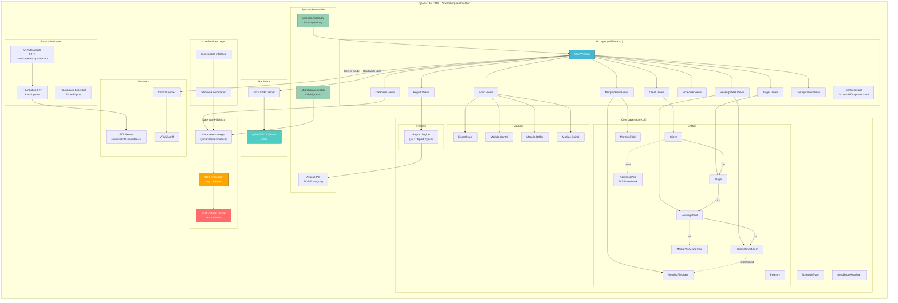

# QUANTEC PRO - Reverse Engineering Tiefenanalyse

**Datum**: 2026-04-04
**Ziel**: Migration von Windows auf macOS
**Status**: Initiale Analyse abgeschlossen

---

## 1. Executive Summary

QUANTEC PRO ist eine **.NET 4.0 WPF Desktop-Anwendung** (Windows Presentation Foundation), die am **13.11.2018** kompiliert wurde. Die Anwendung ist mit **SmartAssembly 6.9.0.114** obfuskiert, was das Reverse Engineering erschwert aber nicht unmoeglich macht.

Die Anwendung verwendet eine **proprietaere, XOR-verschluesselte Block-Datenbank** (`.store`-Format) -- KEINE Standard-Datenbank-Engine (kein SQL Server, SQLite, db4o o.ae.). Der **XOR-Schluessel wurde identifiziert** und die Datenbank kann vollstaendig entschluesselt werden.

### Kritische Erkenntnisse

| Aspekt | Ergebnis |
|--------|----------|
| Framework | .NET 4.0 Client Profile, WPF |
| Obfuskierung | SmartAssembly 6.9.0.114 |
| Build-Datum | 13.11.2018 |
| Datenbank-Engine | Eigenes STOR/BLOC-Format (kein Standard-DB) |
| Verschluesselung | XOR mit 16-Byte-Schluessel (geknackt) |
| DB-Groesse | 1.84 GB, ~13 Mio. BLOC-Records |
| Docker-Migration DB | Moeglich via Export-Tool, nicht direkt |
| Dekompilierung | Moeglich mit ILSpy/dnSpy (trotz SmartAssembly) |

---

## 2. Anwendungsarchitektur

### 2.1 Technologie-Stack

```
Plattform:       Windows, PE32 (32-bit)
Framework:       .NET Framework 4.0 Client Profile
UI-Framework:    WPF (Windows Presentation Foundation) mit XAML
Obfuskierung:    SmartAssembly 6.9.0.114 (Red Gate)
PDF-Engine:      Aspose.Pdf for .NET
Hardware:        FTDI USB-Treiber (QUANTEC6 Geraet)
Serialisierung:  BinaryReader/BinaryWriter + System.Xml.Serialization
Update-Server:   FTP: servicecenter.quantec.eu
Codec:           K-Lite Codec Pack 1300 (Medienwiedergabe)
```

### 2.2 Assembly-Referenzen

| Assembly | Version | Funktion |
|----------|---------|----------|
| `QUANTEC PRO.exe` | - | Haupt-Executable (6.2 MB, alles eingebettet) |
| `CoreServices` | 1.0.0.0 | Kern-Geschaeftslogik (eingebettet) |
| `Core` | 1.0.0.0 | Entity-Modell + Module (eingebettet) |
| `License` | 1.0.0.0 | Lizenzierung (eingebettet) |
| `Migration` | 1.0.0.0 | Datenbank-Migration (eingebettet) |
| `PresentationFramework` | 4.0.0.0 | WPF UI Framework |
| `PresentationCore` | 4.0.0.0 | WPF Core |
| `WindowsBase` | 4.0.0.0 | Windows-Basisbibliothek |
| `Aspose.Pdf` | - | PDF-Erzeugung (24.3 MB DLL) |
| `Microsoft.Threading.Tasks` | - | Async/Await-Support |

### 2.3 Namespace-Hierarchie (aus .NET-Metadaten extrahiert)

```
QUANTEC PRO.exe
  |
  +-- Core (eingebettete Assembly)
  |   +-- Core.Entities        --> Datenmodell (Client, Target, HealingSheet, MorphicField...)
  |   +-- Core.Modules          --> Fachmodule (DentalStatus, Reflex, Spinal)
  |   +-- Core.Reports          --> Berichts-Engine (ReportFilter, SendJobFilter)
  |   +-- Core.Configurations   --> Konfigurationsverwaltung
  |   +-- Core.ScheduleType     --> Zeitplanung
  |   +-- Core.SendType         --> Sendeprofil-Typen
  |
  +-- CoreServices (eingebettete Assembly)
  |   +-- CoreServices.IExecutable  --> Service-Interface
  |
  +-- UI (im Haupt-EXE)
  |   +-- UI.MainWindow         --> Hauptfenster (WPF)
  |   +-- UI.Foot1View / Foot2View  --> Fusszeilen-Views
  |   +-- UI.Parameter          --> Parameter-Dialoge
  |   +-- UI.Selection          --> Auswahl-Dialoge
  |   +-- UI.AutoUpdate         --> Auto-Update per FTP
  |
  +-- Foundation (im Haupt-EXE)
  |   +-- Foundation.FTP        --> FTP-Client
  |   +-- Foundation.ExcelXml   --> Excel-Export
  |
  +-- Migration (eingebettete Assembly)
  |   +-- Migration             --> Datenbank-Migration
  |
  +-- License (eingebettete Assembly)
  |   +-- Licensing             --> Lizenzverwaltung
  |
  +-- Controls (XAML)
      +-- Controls.xaml         --> UI-Steuerelemente
      +-- ScheduleTemplates.xaml --> Zeitplan-Vorlagen
```

---

## 3. Datenmodell (Entity Model)

### 3.1 Kern-Entitaeten (aus Core.Entities)

```
Client                    --> Klient/Patient
  +-- Client.Name         --> Name (Vor-/Nachname)
  +-- Client.MediaData    --> Medien (Fotos, Dokumente)
  +-- Client.MobilePhone  --> Mobilnummer
  +-- Client.Note         --> Notizen
  +-- Client.Tab          --> UI-Tab-Zuordnung
  +-- Client.Card         --> Klienten-Karte
  +-- Client.Access       --> Zugriffsrechte
  +-- Client.Message      --> Nachrichten
  +-- Client.Placeholder  --> Platzhalter-Felder
  +-- Client.Selection    --> Auswahl-Kriterien

Target                    --> Zielobjekt (Behandlungsziel)
  +-- Target.Card         --> Ziel-Karte
  +-- Entity.Name         --> Name
  +-- Entity.Comment      --> Kommentar

HealingSheet              --> Behandlungsblatt
  +-- HealingSheet.Name   --> Bezeichnung
  +-- HealingSheet.Active --> Aktiv-Status
  +-- HealingSheet.IsTemplate --> Vorlage ja/nein
  +-- HealingSheet.CreationDate --> Erstellungsdatum
  +-- HealingSheet.HasAdvice --> Hat Beratungstext
  +-- HealingSheet.Item   --> Einzeleintraege
  +-- HealingSheet.MediaData --> Medien
  +-- HealingSheet.Placeholder --> Platzhalter
  +-- HealingSheet.Card   --> Karte

MorphicField              --> Morphisches Feld
  +-- IMorphicField       --> Interface
  +-- MorphicFieldItem    --> Einzeleintrag

Gender                    --> Geschlecht
AddressePos               --> Adress-Position (PLZ-Datenbank)
MediaPos / MediaType      --> Medien-Position / -Typ
Potency                   --> Potenz/Intensitaet
HighlightColor            --> Hervorhebungsfarbe
```

### 3.2 Beziehungsmodell

```
Client (1) ---< (n) Target ---< (n) HealingSheet ---< (n) HealingSheet.Item
                                         |
                                         +--- verweist auf --> MorphicField.Item
                                         +--- hat --> MediaData
                                         +--- hat --> Advice

MorphicField (1) ---< (n) MorphicFieldItem

AddressePos (PLZ-Datenbank) --> wird referenziert von Client-Adressen
```

---

## 4. Datenbank-Analyse

### 4.1 STOR/BLOC-Format (.store-Dateien)

**Format**: Proprietaere Block-Datenbank mit XOR-Verschluesselung

```
XOR-Schluessel (16 Bytes): bd ee ea c7 35 a5 64 6b 15 d8 3e 64 bb 89 df 93
```

#### Datei-Struktur (nach Entschluesselung):

```
+---------------------------+
| STOR Header (32 Bytes)    |
|   Magic: "STOR"           |
|   Version/Flags: 4 Bytes  |
|   Metadata: 8 Bytes       |
|   Padding: 16 Bytes       |
+---------------------------+
| BLOC Record #1            |
|   Magic: "BLOC"           |
|   Hash/ID: 4 Bytes        |
|   Size: 4 Bytes           |
|   Offset/Seq: 4 Bytes     |
|   Data Payload: variabel  |
|   Padding bis 96 Bytes    |
+---------------------------+
| BLOC Record #2            |
|   ...                     |
+---------------------------+
| ... (ca. 13 Mio Records)  |
+---------------------------+
```

#### Statistiken:

| Metrik | Wert |
|--------|------|
| Dateigrösse (Haupt) | 1.977.266.592 Bytes (1.84 GB) |
| Dateigrösse (Alt) | 6.364.192 Bytes (6.1 MB) |
| Geschaetzte BLOC-Records | ~13.158.948 |
| Durchschnittliche Block-Groesse | ~150 Bytes |
| Verschluesselung | XOR, 16-Byte Schluessel |
| Entropie (verschluesselt) | 6.66 bits/byte |
| Entropie (entschluesselt) | ~4-5 bits/byte (strukturierte Daten) |

#### Identifizierte Daten-Typen in der DB:

1. **PLZ-Datenbank** (Oesterreich/Deutschland): Postleitzahlen, Staedte, Regionen
   - Beispiel: "1010" -> "Wien", "12345" -> "Musterstadt"
2. **Klienten-Stammdaten**: Name, Adresse, Anrede
   - Beispiel: "Musterfrau", "Musterstrasse 1", "Sehr geehrte Frau Musterfrau"
3. **Versionsinfo**: "11800" (Version 1.18.00?)

### 4.2 Weitere Dateiformate

| Datei-Typ | Erweiterung | Verschluesselung | Inhalt |
|-----------|-------------|-------------------|--------|
| Store-DB | `.store` | XOR (16-byte, geknackt) | Hauptdatenbank |
| Alt-DB | `.dbaf` | Anders verschluesselt (nicht geknackt) | Aelteres DB-Format |
| ExpertScan | `.es` | XOR (16-byte, anderer Key) | Fach-Wissensbasis (z.B. "WIR"=Wirtschaft, "PSY"=Psychologie) |
| MorphicField | `.mf` | Verschluesselt | Morphische-Feld-Daten |
| Log-Backup | `_bak` | Nicht verschluesselt | Rotierte Logdateien (je 10 MB) |
| Settings | `.settings` | Klartext XML | Anwendungskonfiguration |
| Config | `.exe.config` | Klartext XML | .NET-Konfiguration |

### 4.3 Backup-Mechanismus

```
Backup-Pfad (konfiguriert): C:\Users\Ben\Desktop\Quantec Sicherung
Letztes Backup:             31.03.2024 17:45:23
Backup-Format:              Kopie der .store-Datei mit Zeitstempel
Beispiel:                   "QUANTEC PRO 2018.09.26 16.27.17.store"
```

Vorhandene Backups (chronologisch):
- 2018-07-13 (219 MB)
- 2018-07-18 (219 MB)
- 2018-07-29 (277 MB)
- 2018-09-21 (1.14 GB) -- Sprung!
- 2018-09-26 (1.14 GB)
- Aktuell (1.84 GB)

---

## 5. Modul-Uebersicht

### 5.1 Fachmodule

| Modul | Namespace | Funktion |
|-------|-----------|----------|
| **Dental** | `Module.Dental`, `Report.DentalStatus` | Zahnstatus-Modul |
| **Reflex** | `Module.Reflex`, `Report.ReflexZoneStatus` | Reflexzonen-Modul |
| **Spinal** | `Module.Spinal`, `Report.SpinalStatus` | Wirbelsaeulen-Modul |
| **ExpertScan** | `Scan.ExpertScan` | Experten-Scan Wissensbasis |

### 5.2 Funktionsbereiche

| Bereich | Namespaces | Funktion |
|---------|------------|----------|
| **Klientenverwaltung** | Client, ClientTarget | Stammdaten, Kontakte, Fotos |
| **Behandlungsblaetter** | HealingSheet, HealingSheet.Item | Behandlungsplaene erstellen |
| **Morphische Felder** | MorphicField, MorphicField.Item | Feld-Katalog & Auswahl |
| **Scanner** | Scan, Scan.Categories, Scan.Results, Scan.Search | QUANTEC-Hardware-Scan |
| **Zeitplanung** | Schedule, Schedule.Calendar, Schedule.Butler | Behandlungsplanung |
| **Berichte** | Report.* (15+ Untertypen) | Umfangreiche Berichts-Engine |
| **Datenbank-Mgmt** | Database.Backup, .ImportExport, .Migration, .Organize | DB-Verwaltung |
| **Benutzerverwaltung** | Account, UserManagement | Multi-User, Passwortschutz |
| **Zentralanbindung** | Central, Central.Connection | Server-Mode, VPN |
| **Lizenzierung** | License | Lizenz-Pruefung |
| **Auto-Update** | UI.AutoUpdate | FTP-basiert |
| **Medien** | Media | Bild-/Video-/Audio-Verwaltung |

### 5.3 Hardware-Integration

```
Geraet:          QUANTEC 6 ("Diode")
Schnittstelle:   USB via FTDI-Treiber (CDM21226)
Protokoll:       Seriell (UART optional, konfigurierbar)
Treiber-URL:     http://www.ftdichip.com/Drivers/CDM/CDM21226_Setup.exe
Konfiguration:   rts=true, uart=false (in exe.config)
```

---

## 6. Strukturdiagramm (Mermaid)



---

## 7. Docker-Migration: Machbarkeitsanalyse

### 7.1 Kann die DB in Docker transferiert werden?

**Kurze Antwort**: Nicht direkt, aber mit einem Export-Tool JA.

Die `.store`-Datei ist **keine Standard-Datenbank** (kein SQL, kein Key-Value-Store), sondern ein **proprietaeres Block-Format**. Es gibt keinen existierenden Docker-Container, der dieses Format lesen kann.

### 7.2 Empfohlener Ansatz

```
Phase 1: Store-Decryptor Tool bauen
  --> Python/C# Script das XOR-Entschluesselung anwendet
  --> BLOC-Records parst und strukturiert

Phase 2: Record-Parser entwickeln
  --> Entity-Typen identifizieren (Client, Target, HS, MF, PLZ...)
  --> Felder-Mapping erstellen
  --> Daten in strukturiertes Format exportieren (JSON/CSV)

Phase 3: Standard-DB aufsetzen (Docker)
  --> PostgreSQL oder SQLite Container
  --> Schema basierend auf Entity-Modell erstellen
  --> Import der exportierten Daten

Phase 4: Verifikation
  --> Datenvollstaendigkeit pruefen
  --> Referentielle Integritaet sicherstellen
```

### 7.3 Was bereits moeglich ist

| Schritt | Status | Details |
|---------|--------|---------|
| XOR-Entschluesselung | GELOEST | 16-Byte-Key bekannt |
| BLOC-Structure parsen | MACHBAR | Header-Format identifiziert |
| Entity-Typen erkennen | TEILWEISE | Typ-Info muss aus Block-Metadaten extrahiert werden |
| .dbaf Format | OFFEN | Anderer Schluessel, noch nicht geknackt |
| .es/.mf Formate | OFFEN | Eigene Schluessel, teilweise Struktur erkannt |

### 7.4 Alternative: Wine/Mono in Docker

```
Option B: QUANTEC PRO.exe in Docker mit Wine/Mono ausfuehren
  Vorteile:
    + Sofortige Datenbanknutzung ohne Konvertierung
    + Alle Formate werden nativ gelesen
  Nachteile:
    - WPF wird von Mono NICHT unterstuetzt
    - Wine-WPF-Support ist experimentell und instabil
    - Hardware-Integration (FTDI) muesste durchgereicht werden
    - Kein nachhaltiger Ansatz fuer Mac-Migration
  Bewertung: NICHT EMPFOHLEN fuer Produktionsbetrieb
```

---

## 8. Migrations-Strategie (Empfehlung)

### Phase 1: Daten sichern und extrahieren
1. `.store`-Datei mit bekanntem XOR-Key entschluesseln
2. BLOC-Records parsen und kategorisieren
3. Entity-Daten in Standard-Format exportieren (PostgreSQL/SQLite)
4. PLZ-Datenbank separat extrahieren

### Phase 2: .NET Assembly dekompilieren
1. **ILSpy** oder **dnSpy** verwenden (kostenlos, Open Source)
2. SmartAssembly-Obfuskierung kann mit **de4dot** teilweise entfernt werden
3. Geschaeftslogik aus Core/CoreServices extrahieren
4. Entity-Modell vollstaendig rekonstruieren

### Phase 3: Mac-native Anwendung entwickeln
Optionen:
- **Electron/React** (Cross-Platform, schnellste Entwicklung)
- **.NET MAUI** (C#-Kenntnisse wiederverwendbar, native Mac-Support)
- **Swift/SwiftUI** (Beste Mac-Integration, hoechster Aufwand)

### Phase 4: Hardware-Integration
- FTDI-Treiber existiert fuer macOS
- Serielles Protokoll muss aus dekompiliertem Code extrahiert werden
- USB-Kommunikation auf Mac via libftdi oder FTDI D2XX-Treiber

---

## 9. Risikobewertung

| Risiko | Schwere | Wahrscheinlichkeit | Mitigation |
|--------|---------|---------------------|------------|
| SmartAssembly blockiert Dekompilierung vollstaendig | Hoch | Niedrig | de4dot kann 90%+ entfernen |
| .dbaf-Format nicht knackbar | Mittel | Mittel | Evtl. nicht fuer Migration noetig |
| QUANTEC-Hardware-Protokoll undokumentiert | Hoch | Hoch | USB-Sniffer auf Windows nutzen |
| Lizenz-System blockiert neue App | Mittel | Mittel | Lizenz-Logik dekompilieren |
| Datenbank-Schema unvollstaendig | Mittel | Mittel | Iterativ mit Testdaten verifizieren |

---

## 10. Dateien-Inventar

### _QUANTEC PRO/ (Installationsverzeichnis)

| Datei | Groesse | Funktion |
|-------|---------|----------|
| `QUANTEC PRO.exe` | 6.2 MB | Hauptanwendung (.NET 4.0 WPF) |
| `QUANTEC PRO.exe.config` | 1.2 KB | .NET-Konfiguration |
| `QUANTEC PRO.settings` | 4.0 KB | Benutzereinstellungen (XML) |
| `QUANTEC PRO.store` | 1.84 GB | Hauptdatenbank (XOR-verschluesselt) |
| `QUANTEC PROalt.store` | 6.1 MB | Aeltere/leere Datenbank |
| `Aspose.Pdf.dll` | 24.3 MB | PDF-Bibliothek |
| `QUANTEC_Log.log` | 10.2 MB | Aktuelle Logdatei |
| `QUANTEC_Log_*_bak` | je 10 MB | 13 Log-Backups (2018-2021) |
| `TeamViewerQS_de.exe` | 8.3 MB | Fernwartungstool |
| `Update/CDM21226_Setup.exe` | 2.1 MB | FTDI USB-Treiber |
| `Update/K-Lite_Codec_Pack_1300_Basic.exe` | 14.4 MB | Mediencodecs |

### Quantec_installer/ (Installationsmedium)

| Datei | Groesse | Funktion |
|-------|---------|----------|
| `INSTALLER QUANTEC PRO-...-Standalone-1.exe` | 40.6 MB | .NET Installer |
| `db_renners-paessler_20150615.dbaf` | 143 MB | Aeltere Datenbank (2015) |
| `Renners-Paessler_20180705.mf` | 164 MB | Morphic-Field-Daten |
| `69PRO_WIR-...es` | 0.5 MB | ExpertScan: Wirtschaft |
| `71PRO_PSY-...es` | 47.4 MB | ExpertScan: Psychologie |
| `Quantec Sicherung/` | ~2 GB | Backup-Verzeichnis mit 5 .store-Dateien |

---

## 11. Naechste Schritte

1. **[PRIORITAET 1]** .NET-Dekompilierung mit ILSpy/dnSpy + de4dot durchfuehren
2. **[PRIORITAET 1]** Store-Reader-Tool in Python entwickeln (XOR + BLOC-Parser)
3. **[PRIORITAET 2]** Entity-Schema vollstaendig rekonstruieren
4. **[PRIORITAET 2]** Daten in PostgreSQL/SQLite exportieren und Docker-Container bereitstellen
5. **[PRIORITAET 3]** Hardware-Protokoll per USB-Sniffer dokumentieren
6. **[PRIORITAET 3]** Mac-native UI-Technologie evaluieren und Prototyp erstellen
